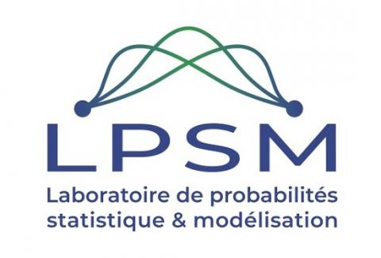

## Do we need rebalancing strategies? A theoretical and empirical study around SMOTE and its variants.

Repository for [Do we need rebalancing strategies? A theoretical and empirical study around SMOTE and its variants](https://arxiv.org/pdf/2402.03819.pdf) paper.

In praticular, you will find code to reproduce the paper experiments as well as an nice implementation of our *new* and *efficient* strategy for your projects.

## Table of Contents
  - [Getting Started](#getting-started)
  - [Data sets](#data-sets)
  - [Acknowledgements](#acknowledgements)

## Getting Started

If you want to reproduce our paper experiments:
  - the notebooks [here](notebooks/classif_experiments.ipynb) and [here](notebooks/distances_experiments.ipynb) reproduce the experiments
  - thise [code](./validation) contains implementation the protocols used for the numerical experiments of our article. 

In order to use our MGS strategy:
  - this [notebook](notebooks/resampling_example.ipynb) illustrates how to use it
  - the strategy is implemented [here](./oversampling_strategies/)

## Data sets

The data sets of used for our article should be dowloaded  inside the *data/externals* folder. The data sets are available at the followings adresses :

* [Pima](https://www.kaggle.com/datasets/uciml/pima-indians-diabetes-database)
* Phoneme : https://github.com/jbrownlee/Datasets/blob/master/phoneme.csv 
* Abalone : https://archive.ics.uci.edu/dataset/1/abalone
* Wine : https://archive.ics.uci.edu/dataset/186/wine+quality
* Haberman : https://archive.ics.uci.edu/dataset/43/haberman+s+survival
* Yeast : https://archive.ics.uci.edu/dataset/110/yeast
* Vehicle : https://archive.ics.uci.edu/dataset/149/statlog+vehicle+silhouettes
* Ionosphere : https://archive.ics.uci.edu/dataset/52/ionosphere
* Breast cancer Wisconsin : https://archive.ics.uci.edu/dataset/15/breast+cancer+wisconsin+original
* CreditCard : https://www.kaggle.com/datasets/mlg-ulb/creditcardfraud
* MagicTel : https://www.openml.org/d/44125
* California : https://www.openml.org/d/44090
* House_16H : https://openml.org/d/821 

Table 2 from  [the paper](https://arxiv.org/pdf/2402.03819.pdf) :

| Strategy                                  | None    | CW               | RUS              | ROS              | NM1    | BS1     | BS2     |  SMOTE     | CV SMOTE              | MGS  ($d+1$)               |
|-------------------------------------------|---------|------------------|------------------|------------------|---------|---------|---------|------------------|------------------|---------------------|
|  CreditCard (0.2\%)          | $0.966$ | $0.967$          | **0.970** | $0.935$          | $0.892$ | $0.949$ | $0.944$ | $0.947$          | $0.954$          | $0.952$             |
|  Abalone (1\%)               | $0.764$ | $0.748$          | $0.735$          | $0.722$          | $0.656$ | $0.744$ | $0.753$ | $0.741$          | $0.791$          | **0.802**    |
|  *Phoneme* (1\%)      | $0.897$ | $0.868$          | $0.868$          | $0.858$          | $0.698$ | $0.867$ | $0.869$ | $0.888$          | **0.924** | $0.915$             |
|  *Yeast* (1\%)        | $0.925$ | $0.920$          | $0.938$          | $0.908$          | $0.716$ | $0.949$ | $0.954$ | **0.955** | $0.942$          | $0.945$             |
|  Wine (4\%)                  | $0.928$ | $0.925$          | $0.915$          | $0.924$          | $0.682$ | $0.933$ | $0.927$ | $0.934$          | $0.938$          | **$0.941$**    |
|  *Pima* (20\%)        | $0.798$ | **0.808** | $0.799$          | $0.790$          | $0.777$ | $0.793$ | $0.788$ | $0.789$          | $0.787$          | $0.787$             |
|  *Haberman* (10\%)    | $0.708$ | $0.709$          | $0.720$          | $0.704$          | $0.697$ | $0.723$ | $0.721$ | $0.719$          | $0.742$          | **0.744**    |
|  *MagicTel* (20\%)    | $0.917$ | $0.921$          | $0.917$          | **0.922** | $0.649$ | $0.920$ | $0.905$ | $0.921$          | $0.919$          | $0.913$             |
|  *California* (1\%) | $0.887$ | $0.877$          | $0.880$          | $0.883$          | $0.630$ | $0.885$ | $0.874$ | $0.906$          | $0.916$          | **0.923**    |

## Acknowledgements

This work was done through a partenership between **Artefact Research Center** and the **Laboratoire de Probabilités Statistiques et Modélisation** (LPSM) of Sorbonne University.

  |  
:-------------------------:|:-------------------------:
